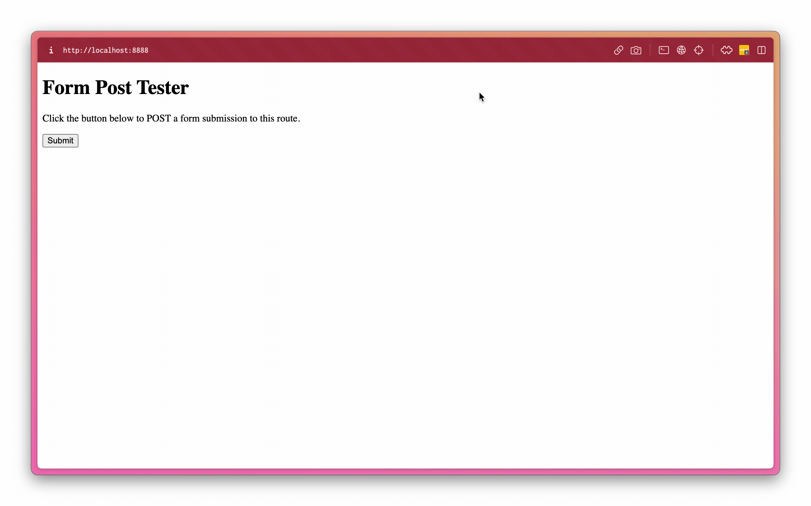
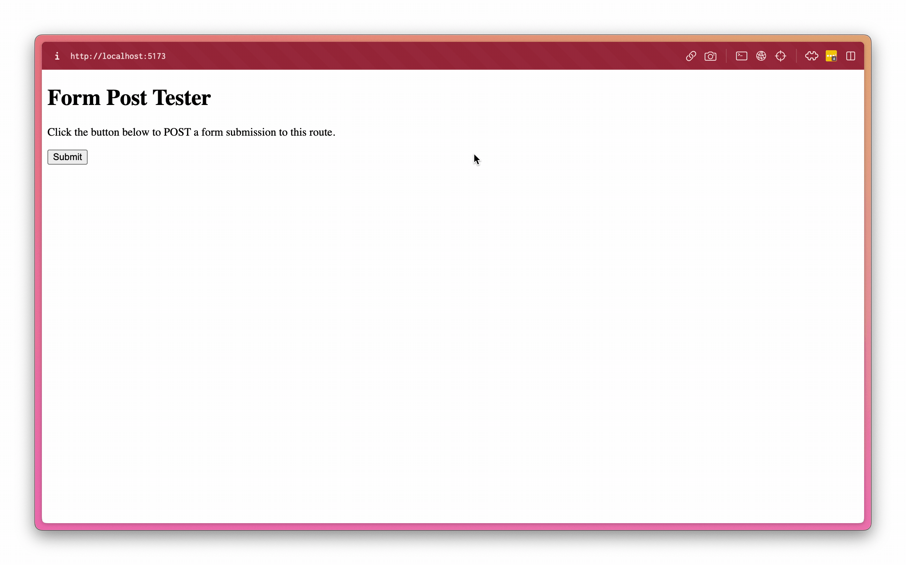

# Netlify Dev Error Demo

While using Netlify CLI's local `dev` feature, everything works except POSTing to form actions.

## Reproduction

1. Clone this repo
1. Open a terminal to the repo's directory
1. Install dependencies (I use `pnpm`)
1. Run `netlify dev` using your preferred package manager. For example, `pnpm exec netlify dev`. This will use the version of `netlify-cli` specified in `package.json` instead of your global install.
1. Open the development site specified in the `dev` command output - mine is usually `localhost:8888`, while the SvelteKit route is `localhost:5173`
1. Click the "Submit" button in the index (`/`) route.
1. Error will occur

 

 

**NOTE:** Repeating the last two steps on on the SvelteKit server (`localhost:5173` for me), should yield a redirect to the `/success` page.

## What's happening

After walking through the reproduction steps, the web browser displays an error: `Function not found...`.

## What I'm expecting to happen

After walking through the reproduction steps, the web browser is redirected `/success`.

